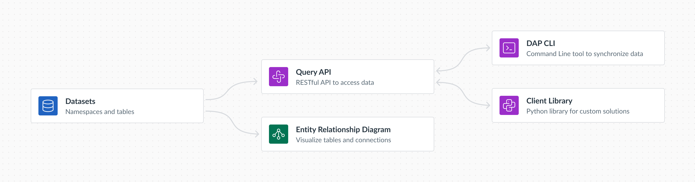

# Key Concepts

\[some intro]


In this and other documentation, CD2 (Canvas Data 2) and DAP (Data Access Platform) are used interchangeably and refer to the same platform. Whether a feature is labeled as CD2 or DAP, it serves the same function within this system.


## The Platform

<figure><figcaption>
Entities and tools in Data Access Platform
</figcaption></figure>

### Datasets

Datasets are the core data sources in DAP. Data is stored in tables, which are organized into namespaces. For example, the Canvas tables such as `assignments`, `content_tags`, and `submissions` are part of the `canvas` namespace, while the `web_logs` table is under the `canvas_logs` namespace. Other products have their own namespaces, such as `catalog`.

Data within datasets cannot be accessed directly; it is only available through the Query API, DAP CLI, or Client Library.

#### Entity Relationship Diagram (ERD)&#x20;

The Entity Relationship Diagram (ERD) is a lightweight tool for exploring datasets in DAP. It helps you understand the data structure, table schemas, and relationships between tables.

### Query API

The DAP Query API is a robust RESTful API that enables seamless, programmatic access to data within the Data Access Platform (DAP). Designed to handle large-scale data retrieval, it supports secure, flexible interactions with Instructure datasets.

### Command Line (DAP CLI)

The DAP CLI is a command-line tool that provides efficient access to large volumes of data with high fidelity and low latency. It offers a convenient way to interact with the Query API, synchronize data to your database, or export data in various file formats.

### Client Library

The Client Library comes bundled with the DAP CLI installation. Similar to the command-line tool, it offers a seamless way to interact with the Query API. Written in Python, it allows you to build custom solutions tailored to your data needs.

