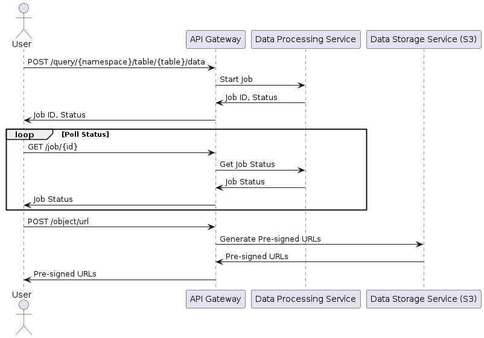

# Query API

The Data Access Platform (DAP) CLI is a command-line tool that enables efficient access to large volumes of educational data with high fidelity and low latency. It adheres to a canonical data model and integrates with various educational products.

Built on top of the Query API, DAP CLI allows you to:

* Fetch initial snapshots of data.
* Track incremental changes.
* Initialize and synchronize a supported database with DAP data.

Before using DAP CLI, it is recommended to familiarize yourself with the key concepts of DAP.

#### Requirements

* **Supported Operating Systems:** Ubuntu 22, Windows 11, Windows Server 2022, macOS 14
* **Supported Database Integrations:** PostgreSQL 16.3+, MySQL 8.2+
* **Supported Python Versions:** Python 3.11+

<details>

<summary>dfsfdssfd</summary>



</details>


#### Commands

The basic syntax is:

```bash
dap [arguments] [command] [flags]
```

Refer to Reference section in the sidebar for a list of available commands. Or, run the `dap --help` command to get this information right in the terminal.

#### Upgrading

To ensure optimal performance, always use the latest version of DAP CLI. Check your current version with:

```bash
dap --version
```

To upgrade to the latest version, run:

```bash
pip install --upgrade instructure-dap-client
pip install --upgrade "instructure-dap-client[postgresql,mysql]"
```

#### Rate Limiting

DAP CLI follows the rate limiting policies of DAP. Be aware of these limits when making requests.

#### Logging & Debugging

The default log level is `info`, and messages are printed to the console. To change the log level or save logs to a file, use the following parameters:

```bash
dap --loglevel debug --logfile dap.log initdb --namespace canvas --table accounts
```

#### Where To Get Help

<table data-card-size="large" data-view="cards"><thead><tr><th></th><th></th><th data-hidden data-card-target data-type="content-ref"></th></tr></thead><tbody><tr><td>DAP Community</td><td>Visit our forums to connect with the community and learn more about DAP.</td><td><a href="https://community.canvaslms.com/t5/Data-and-Analytics-Group/gh-p/data">https://community.canvaslms.com/t5/Data-and-Analytics-Group/gh-p/data</a></td></tr><tr><td>Support</td><td>To report bugs or request new features, open a ticket for our Support Team.</td><td><a href="mailto:canvasdatahelp@instructure.com">mailto:canvasdatahelp@instructure.com</a></td></tr></tbody></table>
